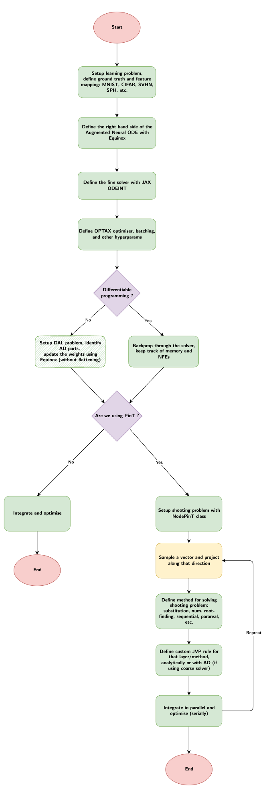

# ParaJax

Scaling differential equations via transferable dynamics.

## Features
- **Faster discovery** of dynamical systems.
- **Better learning** with advanced regularisation of the dynamics.
- **Transfer learning** with all its advantages (sim2real, etc...).
- Interpretable representations of high dimensional data via **latent variable models**.

## Getting started
`pip install parajax`

## ToDos
- Build single examples script for neural ODE, APHYNITY, etc.
- Build a unifying framework

## Flowchart

<!--  -->

## Dependencies
- JAX
- Equinox
